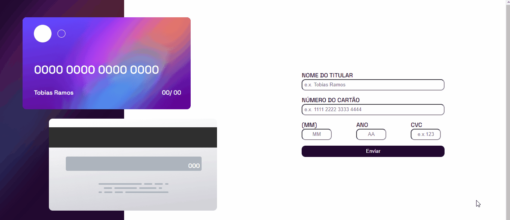

# interactive-card-details-form
Sistema que cadastra os dados de um determinado cartão (seja de crédito ou débido). Cada campo contém sua lógica e quantidade certa de caracteres.

## Tecnologias utilizadas
- HTML
- CSS
- JAVASCRIPT
